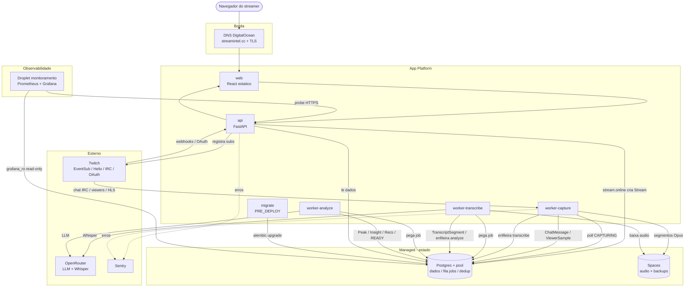

# Arquitetura do StreamIntel

Referência de responsabilidades de cada componente da infraestrutura, para
humanos e agentes. Reflete o estado atual: prod 100% no DigitalOcean App
Platform, DNS na DigitalOcean, e sem Valkey em produção (fila e dedup vivem no
Postgres).

Dois princípios atravessam tudo:

- **Números vêm sempre de SQL; o LLM só escreve texto que cita fatos já
  calculados.** Nenhum número exibido sai do modelo.
- **O Postgres é a única dependência de estado em produção.** A fila de jobs é
  a tabela `jobs` (workers fazem poll), e o dedup do EventSub é a tabela
  `eventsub_messages`. Nada de fila/cache externo no caminho principal.

## Fluxo (diagrama)

## Componentes (em ordem de fluxo)

| # | Componente | Onde roda | Responsabilidade | Consome (input) | Gera (output) | Inicia / Termina |
|---|---|---|---|---|---|---|
| 1 | **DNS (DigitalOcean)** | Managed | Resolve `streamintel.cc` pra borda do app e emite TLS | Query DNS | Registros A/AAAA/CNAME para a borda | Sempre ativo (zona provisionada) |
| 2 | **web** (React) | App Platform, static site | Renderiza o dashboard no navegador | JSON da `api` (`/api/*`) | HTML/UI no browser | Servido por request; buildado no deploy |
| 3 | **api** (FastAPI) | App Platform, service | OAuth, registro de EventSub, ingestão de webhook, serve o dashboard | Requests HTTP, tokens OAuth, notificações EventSub assinadas, leitura do PG | Respostas JSON; linhas `Stream`/`Event`/`Follower`; subs registradas na Twitch | Sobe no deploy; long-running (`/healthz`) |
| 4 | **Twitch** (EventSub/Helix/IRC/OAuth) | Externo | A fonte de tudo: eventos de live, chat, viewers, auth | Nossos pedidos de subscription e OAuth | Webhooks (online/offline/follow/sub/bits), Helix, chat IRC, tokens | Sempre ativo; emite conforme a live |
| 5 | **worker-capture** | App Platform, worker | Captura a live: chat, viewers, audio | IRC (chat), Helix `/streams` (viewers+titulo), HLS via streamlink | `ChatMessage`, `ViewerSample`, segmentos Opus para o Spaces, job `transcribe` | **Inicia:** `stream.online` cria `Stream` (CAPTURING), worker faz poll (3s). **Termina:** `stream.offline` ou Helix offline 3x seguidas |
| 6 | **worker-transcribe** | App Platform, worker | Transcreve o audio pos-live | Job `transcribe` (tabela `jobs`), audio baixado do Spaces, Whisper via OpenRouter | `TranscriptSegment`, job `analyze` | **Inicia:** job `transcribe` em QUEUED (poll 5s). **Termina:** done -> `QUEUED_ANALYSIS`; ou falha apos 3 tentativas |
| 7 | **worker-analyze** | App Platform, worker | Gera insights/picos/recomendacoes | Job `analyze`, chat/viewers/transcricao do PG, LLM via OpenRouter | `Peak`, `Insight`, `*Recommendation`; stream -> READY | **Inicia:** job `analyze` em QUEUED. **Termina:** done -> stream `READY` |
| 8 | **Postgres** + pool PgBouncer | Managed, nyc3 | Fonte unica de verdade: dados, fila de jobs, dedup EventSub | Escritas SQL de api/workers | Resultados de query; a fila (`jobs`); o dedup (`eventsub_messages`) | Sempre ativo (managed). Nunca tirar o pool: cluster compartilhado, ~50 conexoes |
| 9 | **Spaces** (`streamintel-audio`) | Managed, nyc3 | Storage do audio das lives e backups | Upload de segmentos (capture) | Download de audio (transcribe) | Sempre ativo; lifecycle 7d/30d |
| 10 | **OpenRouter** | Externo (API) | Backend remoto de LLM e de transcricao | Audio (transcribe) / prompt + fatos SQL (analyze) | Texto transcrito / JSON de insights | Chamado por job |
| 11 | **Sentry** | Externo (SaaS) | Captura de erros da api/workers | Excecoes instrumentadas | Nada (quota esgotada ate renovar) | Sempre ativo; sem entrega enquanto sem quota |
| 12 | **migrate** | App Platform, PRE_DEPLOY job | Aplica migracoes antes de cada deploy | Scripts alembic + `DATABASE_URL` | Schema atualizado | **Inicia:** antes de todo deploy. **Termina:** sucesso -> deploy segue; falha -> deploy ERROR (funciona como canario) |
| 13 | **Droplet de monitoramento** (`financialdata-monitoring`) | Droplet, compartilhado | Prometheus + Grafana + blackbox + alertas | Probe do site + leitura do PG via `grafana_ro` (read-only) | Dashboards e alertas | Sempre ativo |
| 14 | **~~Valkey~~** (`financialdata-valkey`) | Managed, nyc1 | Fora de producao (fila e dedup foram pro PG) | Apenas chaves `sim:*` do simulador local | Nada em prod | Desativado em prod em 2026-07-16/17 |
| 15 | **~~Droplet `stream-intel`~~** | (destruido) | Era o prod antigo (rsync + docker compose) | - | - | Destruido 2026-07-16; snapshot `stream-intel-pre-retire-20260716` guardado |

Resumo em uma frase: **DNS -> web -> api (login + registra EventSub) -> Twitch
dispara `stream.online` -> capture (chat/viewers/audio) -> transcribe
(audio->texto) -> analyze (texto->insights) -> api/web mostram o relatorio**,
com Postgres e Spaces como lastro em todas as etapas e OpenRouter fazendo o
trabalho pesado de IA.
