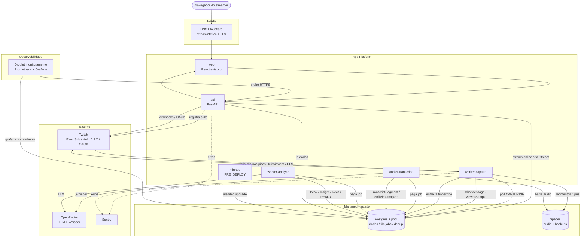

# Arquitetura do StreamIntel

Referência de responsabilidades de cada componente da infraestrutura, para
humanos e agentes. Reflete o estado atual: prod 100% no DigitalOcean App
Platform, DNS na Cloudflare, e sem Valkey em produção (fila e dedup vivem no
Postgres).

Dois princípios atravessam tudo:

- **Números vêm sempre de SQL; o LLM só escreve texto que cita fatos já
  calculados.** Nenhum número exibido sai do modelo.
- **O Postgres é a única dependência de estado em produção.** A fila de jobs é
  a tabela `jobs` (workers fazem poll), e o dedup do EventSub é a tabela
  `eventsub_messages`. Nada de fila/cache externo no caminho principal.

## Fluxo (diagrama)

```mermaid
flowchart TB
    Browser([Navegador do streamer])

    subgraph edge[Borda]
      DNS[DNS Cloudflare<br/>streamintel.cc + TLS]
    end

    subgraph app[App Platform]
      WEB[web<br/>React estatico]
      API[api<br/>FastAPI]
      WC[worker-capture]
      WT[worker-transcribe]
      WA[worker-analyze]
      MIG[migrate<br/>PRE_DEPLOY]
    end

    subgraph data[Managed - estado]
      PG[(Postgres + pool<br/>dados / fila jobs / dedup)]
      SP[(Spaces<br/>audio + backups)]
    end

    subgraph ext[Externo]
      TW[Twitch<br/>EventSub / Helix / IRC / OAuth]
      OR[OpenRouter<br/>LLM + Whisper]
      SE[Sentry]
    end

    subgraph obs[Observabilidade]
      MON[Droplet monitoramento<br/>Prometheus + Grafana]
    end

    Browser --> DNS --> WEB --> API
    API -->|registra subs| TW
    TW -->|webhooks / OAuth| API
    API -->|stream.online cria Stream| PG

    TW -->|chat IRC / viewers / HLS| WC
    WC -->|poll CAPTURING| PG
    WC -->|ChatMessage / ViewerSample| PG
    WC -->|segmentos Opus| SP
    WC -->|enfileira transcribe| PG
    WC -->|cria clip nos picos Helix| TW

    WT -->|pega job| PG
    WT -->|baixa audio| SP
    WT -->|Whisper| OR
    WT -->|TranscriptSegment / enfileira analyze| PG

    WA -->|pega job| PG
    WA -->|LLM| OR
    WA -->|Peak / Insight / Recs / READY| PG

    API -->|le dados| PG
    API --> WEB

    MIG -->|alembic upgrade| PG
    MON -->|probe HTTPS| API
    MON -->|grafana_ro read-only| PG
    API -.erros.-> SE
    WC -.erros.-> SE
```

## Componentes (em ordem de fluxo)

| # | Componente | Onde roda | Responsabilidade | Consome (input) | Gera (output) | Inicia / Termina |
|---|---|---|---|---|---|---|
| 1 | **DNS (Cloudflare)** | Managed | Resolve `streamintel.cc` pra borda do app e emite TLS; encaminha o email do domínio pro Gmail (Email Routing) | Query DNS, email de entrada | Registros A/AAAA/CNAME (DNS-only, sem proxy: a borda do App Platform já é Cloudflare) e MX | Sempre ativo (zona provisionada) |
| 2 | **web** (React) | App Platform, static site | Renderiza o dashboard no navegador | JSON da `api` (`/api/*`) | HTML/UI no browser | Servido por request; buildado no deploy |
| 3 | **api** (FastAPI) | App Platform, service | OAuth, registro de EventSub, ingestão de webhook, serve o dashboard | Requests HTTP, tokens OAuth, notificações EventSub assinadas, leitura do PG | Respostas JSON; linhas `Stream`/`Event`/`Follower`; subs registradas na Twitch | Sobe no deploy; long-running (`/healthz`) |
| 4 | **Twitch** (EventSub/Helix/IRC/OAuth) | Externo | A fonte de tudo: eventos de live, chat, viewers, auth; e o destino dos clips criados | Nossos pedidos de subscription, OAuth e criação de clips (Helix `/clips`) | Webhooks (online/offline/follow/sub/bits), Helix, chat IRC, tokens, o clip criado | Sempre ativo; emite conforme a live |
| 5 | **worker-capture** | App Platform, worker | Captura a live: chat, viewers, audio; e auto-clipa os picos de chat ao vivo | IRC (chat), Helix `/streams` (viewers+titulo), HLS via streamlink | `ChatMessage`, `ViewerSample`, segmentos Opus para o Spaces, job `transcribe`, `TwitchClip` (clip nos picos via Helix `/clips`, scope `clips:edit`, com cooldown e teto por stream) | **Inicia:** `stream.online` cria `Stream` (CAPTURING), worker faz poll (3s). **Termina:** `stream.offline` ou Helix offline 3x seguidas |
| 6 | **worker-transcribe** | App Platform, worker | Transcreve o audio pos-live | Job `transcribe` (tabela `jobs`), audio baixado do Spaces, Whisper via OpenRouter | `TranscriptSegment`, job `analyze` | **Inicia:** job `transcribe` em QUEUED (poll 5s). **Termina:** done -> `QUEUED_ANALYSIS`; ou falha apos 3 tentativas |
| 7 | **worker-analyze** | App Platform, worker | Gera insights/picos/recomendacoes | Job `analyze`, chat/viewers/transcricao do PG, LLM via OpenRouter | `Peak`, `Insight`, `*Recommendation`; stream -> READY | **Inicia:** job `analyze` em QUEUED. **Termina:** done -> stream `READY` |
| 8 | **Postgres** + pool PgBouncer | Managed, nyc3 | Fonte unica de verdade: dados, fila de jobs, dedup EventSub | Escritas SQL de api/workers | Resultados de query; a fila (`jobs`); o dedup (`eventsub_messages`) | Sempre ativo (managed). Nunca tirar o pool: cluster compartilhado, ~50 conexoes |
| 9 | **Spaces** (`streamintel-audio`) | Managed, nyc3 | Storage do audio das lives e backups | Upload de segmentos (capture) | Download de audio (transcribe) | Sempre ativo; lifecycle 7d/30d |
| 10 | **OpenRouter** | Externo (API) | Backend remoto de LLM e de transcricao | Audio (transcribe) / prompt + fatos SQL (analyze) | Texto transcrito / JSON de insights | Chamado por job |
| 11 | **Sentry** | Externo (SaaS) | Captura de erros da api/workers | Excecoes instrumentadas | Nada (quota esgotada ate renovar) | Sempre ativo; sem entrega enquanto sem quota |
| 12 | **migrate** | App Platform, PRE_DEPLOY job | Aplica migracoes antes de cada deploy | Scripts alembic + `DATABASE_URL` | Schema atualizado | **Inicia:** antes de todo deploy. **Termina:** sucesso -> deploy segue; falha -> deploy ERROR (funciona como canario) |
| 13 | **Droplet de monitoramento** (`financialdata-monitoring`) | Droplet, compartilhado | Prometheus + Grafana + blackbox + alertas | Probe do site + leitura do PG via `grafana_ro` (read-only) | Dashboards e alertas | Sempre ativo |
| 14 | **~~Valkey~~** (`financialdata-valkey`) | Managed, nyc1 | Fora de producao (fila e dedup foram pro PG) | Apenas chaves `sim:*` do simulador local | Nada em prod | Desativado em prod em 2026-07-16/17 |
| 15 | **~~Droplet `stream-intel`~~** | (destruido) | Era o prod antigo (rsync + docker compose) | - | - | Destruido 2026-07-16; snapshot `stream-intel-pre-retire-20260716` guardado |

## Fora do caminho do produto: a campanha de convite

Nada disso participa da captura nem do dashboard, mas manda email de verdade em
nome do domínio, então tem dono e tem freio. Estado em 2026-07-30:

| # | Componente | Onde roda | Responsabilidade | Início / Fim |
|---|---|---|---|---|
| 16 | **Timers da campanha** | Droplet `lekture-sfu` (compartilhado com outro projeto) | Dispara os lotes 10 a 14 (1.047 emails) por systemd timer, terça a quinta 10h BRT, cada um passando pelo portão antes | Ativos até 2026-08-11 |
| 17 | **Limpeza da campanha** | Mesmo droplet | Apaga `/opt/streamintel-campanha` e a chave do Resend depois do último lote. Trava: se o lote-14 não tiver saído, **não apaga** e manda email | Dispara 2026-08-12 03h |
| 18 | **Actor `streamintel-campanha`** | Apify | Assume a campanha depois do droplet. Modo `colher` (todo dia 03h): sweep na Twitch + busca no Google dentro do teto de gasto, qualifica na Helix, empilha na fila. Modo `enviar` (seg a sex 10h): tira até 300 da fila, passa pelo portão, manda pelo Resend | Colheita ativa; envio travado até 2026-08-12 |
| 19 | **Resend** | Externo (SaaS) | Entrega o convite pelo subdomínio `send.streamintel.cc` (DKIM + SPF no return-path, DMARC `p=none` no domínio raiz) | Chamado por lote |

O portão (`scripts/campaign_stats.py --portao <lote>`) é a peça que protege o
domínio: ele lê a entrega de cada endereço na API do Resend e recusa o disparo se
o lote já foi enviado, se o lote anterior não saiu, se o bounce duro chegou a 3%
ou se houve **qualquer** reclamação de spam. Em 2026-07-29 ele barrou um envio de
verdade, com o lote-8 fechando em 3,3%.

**Limitação de idioma, hoje.** O produto só funciona em português: o prompt do
LLM pede texto em português do Brasil, e `core/text.py` traz stopwords e léxico de
sentimento brasileiros, usados por `dashboard.py` e `community.py`. Para um canal
em inglês, "assuntos da live" listaria `the`/`you` e a reação do chat viria vazia.
O campo `channels.language` (migração 0020) já guarda o idioma que a Helix
reporta, mas ainda não muda comportamento nenhum: é a fase 1 de quatro. Por isso
os 4.417 leads em inglês seguem parados na base, e o `qualify` só deixa português
entrar na fila de envio.

Resumo em uma frase: **DNS -> web -> api (login + registra EventSub) -> Twitch
dispara `stream.online` -> capture (chat/viewers/audio) -> transcribe
(audio->texto) -> analyze (texto->insights) -> api/web mostram o relatorio**,
com Postgres e Spaces como lastro em todas as etapas e OpenRouter fazendo o
trabalho pesado de IA.
