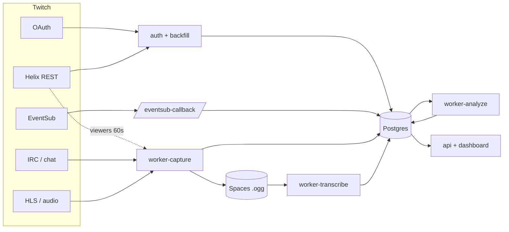

# Stream Intel

Plataforma de analytics multimodal para streamers da Twitch. Captura chat,
eventos (EventSub) e áudio de cada live, transcreve (Whisper), detecta picos
por SQL e gera relatório com LLM: resumo, explicação dos picos, assuntos
ranqueados e recomendações, sempre com evidência clicável verificada contra o
banco. Números vêm sempre de SQL; o LLM só escreve texto que cita fatos já
calculados.

A IA é plugável, trocada por env e não por código: **produção usa OpenRouter**
(Whisper remoto + Claude Haiku/Sonnet), mas o mesmo pipeline roda **100% local**
em dev (faster-whisper + llama.cpp em CPU, sem API paga).

Produção de referência: https://streamintel.cc

## Arquitetura

Responsabilidade de cada componente da infra (com input/output, gatilhos e um
diagrama de fluxo): [`ARCHITECTURE.md`](ARCHITECTURE.md). O layout de pastas
abaixo é o do repositório; a descrição de prod aqui pode estar defasada, o
`ARCHITECTURE.md` é a fonte da verdade do que roda hoje.

```
apps/api           FastAPI: OAuth Twitch, webhook EventSub, API do dashboard
apps/web           React + Vite + Tailwind + Chart.js (build servido pelo Caddy)
workers/capture    IRC do chat, amostrador de viewers, gravador HLS->Opus
workers/transcribe VAD + Whisper (OpenRouter em prod, faster-whisper em dev)
workers/analyze    picos por SQL + insights via LLM (OpenRouter/llama.cpp), evidência validada
core               modelos, config, filas, crypto, cliente Twitch, métricas, recordes
scripts            simulador de live, seed de estados, benchmark, backup, backfill de recordes
deploy             Dockerfile, docker compose (dev + prod), Caddyfile
```

Serviços do compose (dev): `api`, `worker-capture`, `worker-transcribe`,
`worker-analyze`, `caddy`, `postgres` e `valkey`. Em produção (App Platform) não
há droplet, Postgres local nem Valkey: a fila de jobs e o dedup do EventSub
vivem no Postgres gerenciado, e o Valkey serve só o simulador de live em dev.

## Fontes de dados da Twitch

Não é uma API só. O sistema puxa dados por cinco caminhos, todos protocolo
oficial da Twitch (nada de scraping de HTML nem GraphQL privado). Todas as
fontes convergem no Postgres; os workers leem de lá e do storage.



| Fonte | Puxa | Grava em | Usado para |
|---|---|---|---|
| **OAuth** (`id.twitch.tv`) | access + refresh token, scopes, identidade (`/users`) | `channels` (token cifrado) | autentica as outras 4 fontes; os scopes definem o que dá pra ler |
| **Helix REST** (`api.twitch.tv/helix`) | histórico de followers, VODs, subs, bits, metas, VIPs e perfis; ao vivo, viewers + título via `/streams` | `followers`, `past_broadcasts`, `subscriptions`, `bits_leaders`, `goals`, `vips`, `viewer_samples` | dados reais já no connect; base das recomendações; retenção e quedas na análise |
| **EventSub** (webhook `/eventsub/callback`) | 19 tipos de evento ao vivo: subs, bits, follows, raids, enquetes, previsões, hype trains, ads | `events` (+ upsert em `followers`) | timeline por live, contagem por stream, causa das quedas (`dip_cause`) |
| **IRC / TMI** (`irc.chat.twitch.tv:6667`) | cada mensagem de chat: autor, badges, emotes, texto, timestamp | `chat_messages` | detecção de picos que o LLM explica; resumos e assuntos com evidência |
| **HLS** (`twitch.tv/{login}`) | áudio da transmissão (streamlink `audio_only`) | segmentos `.ogg` no Spaces, depois `transcript_segments` | resumo, assuntos e recomendações ancorados em fala real |

O histórico vem por pull (Helix, uma vez no connect). O ao vivo vem por push
(EventSub e IRC) e por polling (viewers no Helix a cada 60s, áudio no HLS).
Cada webhook é verificado por HMAC-SHA256 e deduplicado por `message_id`;
tokens nunca vão pro log; todo request tem timeout. Detalhe por endpoint no
código: `core/twitch.py`, `core/eventsub.py`, `core/irc.py`,
`core/backfill.py`, `workers/capture/collectors.py`.

## Desenvolvimento local

Pré-requisitos: Docker, uv, Node 20+.

```bash
uv sync                        # deps Python (.venv)
make web                       # build do frontend (apps/web/dist)
make up                        # sobe o stack (Caddy em http://localhost:8080)
```

Portas no host: web/api `8080`, Postgres `5433`, Valkey `6380`.
`deploy/sim.env` fornece defaults de dev (secret do EventSub, whisper tiny,
LLM 1.5B); qualquer valor no `.env` da raiz tem precedência.

Modelos locais (uma vez): baixe um GGUF para `data/models/` e confira o
caminho em `deploy/sim.env` (`LLM_GGUF_PATH`). O whisper baixa sozinho no
primeiro uso.

### Simulação de live (sem Twitch real)

```bash
uv run python scripts/simulate_stream.py --minutes 4 --audio caminho/audio.mp3
```

Publica chat/eventos/viewers/áudio pelos MESMOS caminhos de código da
captura real (webhook assinado, parser IRC). Ao final, a live percorre
transcrição -> análise -> `ready` sozinha.

Para popular o dashboard com todos os estados do pipeline (e uma live
analisável pelo LLM):

```bash
docker compose -f deploy/docker-compose.yml stop worker-transcribe worker-analyze
uv run python scripts/seed_pipeline_states.py            # canal mock
docker compose -f deploy/docker-compose.yml start worker-transcribe worker-analyze
```

### Testes e qualidade

```bash
make lint       # ruff + mypy
make test       # pytest (testes de banco usam o Postgres do compose)
make test-web   # vitest (frontend)
make test-all   # tudo
```

## Variáveis de ambiente

Documentadas em `deploy/env.example`. Essenciais em produção:
`TWITCH_CLIENT_ID/SECRET` (app em dev.twitch.tv com redirect
`https://SEU_DOMINIO/auth/callback`), `TWITCH_EVENTSUB_SECRET` (string
aleatória), `PUBLIC_BASE_URL` (https), `FERNET_KEY`, `DATABASE_URL`,
`SPACES_*` (áudio + backups; sem eles cai em disco local), `SIMULATION=0`.
Para a IA remota (prod): `LLM_BACKEND=openai`, `LLM_BASE_URL` + `LLM_API_KEY`
(OpenRouter), `LLM_MODEL` e `LLM_MODEL_STRONG`, e `TRANSCRIBE_BACKEND=remote`
com `TRANSCRIBE_BASE_URL/API_KEY/MODEL`. Em dev, o default é local (GGUF +
faster-whisper), sem essas chaves.

## Deploy em produção (DigitalOcean App Platform)

Produção roda 100% no App Platform (spec em `deploy/app.yaml`): os componentes
`web`, `api`, `worker-capture`, `worker-transcribe`, `worker-analyze` e o job
`migrate` (PRE_DEPLOY). Estado só no Postgres gerenciado (via pool PgBouncer) e
no Spaces; sem droplet e sem Valkey. A responsabilidade de cada peça está em
[`ARCHITECTURE.md`](ARCHITECTURE.md), a fonte da verdade do que roda hoje.

Deploy é git: **um push na `main` dispara o deploy** de cada componente
(`deploy_on_push: true`). Antes de cada deploy, o job `migrate` roda
`alembic upgrade head`; se a migração falhar, o deploy vira ERROR e a versão
atual continua no ar (funciona como canário). Não há passo manual de migração.

```bash
doctl apps list                          # acha o app (streamintel)
doctl apps get <APP_ID>                  # status + ingress
doctl apps list-deployments <APP_ID>     # histórico de deploys
doctl apps logs <APP_ID> <componente>    # logs em runtime
doctl apps update <APP_ID> --spec deploy/app.yaml   # aplica mudança de infra/spec
```

Segredos (`FERNET_KEY`, `DATABASE_URL`, `TWITCH_*`, `SPACES_*`, `LLM_API_KEY`,
...) ficam como `SECRET` no dashboard do App Platform, nunca no repo. Depois do
primeiro login em `https://streamintel.cc`, as subscriptions EventSub são
registradas automaticamente e qualquer live do canal passa a ser capturada.

Para rodar um comando pontual em prod (ex. backfill), use o console do
componente: `doctl apps console <APP_ID> worker-analyze`.

## Backup e restauração

O Postgres gerenciado da DigitalOcean mantém backups diários automáticos com
point-in-time restore: essa é a camada primária. `scripts/backup_db.py` é o
backup portátil extra (pg_dump -> gzip -> Spaces `backups/` com retenção de 30
dias; sem Spaces, disco local). Rode sob demanda pelo console do componente que
tem o `DATABASE_URL`:

```bash
doctl apps console <APP_ID> worker-capture   # depois: python scripts/backup_db.py
```

Restauração: baixe o `.sql.gz` do Spaces e aplique com `psql` na URL do banco
(sem o sufixo `+psycopg`).

## Operação

- Logs (JSON estruturado): prod `doctl apps logs <APP_ID> api` (ou
  `worker-capture` etc.); dev `docker compose ... logs -f api`
- Healthchecks: api via `/healthz`; workers via ping no banco
- Reprocessar uma live: enfileire um job `analyze` para o stream
  (a análise é idempotente; veja `core/queues.enqueue_job`)
- Re-sincronizar EventSub: refaça o login no dashboard
- Trocar modelo LLM: em prod ajuste `LLM_MODEL` / `LLM_MODEL_STRONG` no App
  Platform; em dev troque o GGUF e o `LLM_GGUF_PATH`
- Recordes das lives antigas: `python scripts/backfill_records.py` pelo console
  (idempotente; distribui os recordes pelo histórico já capturado, e os badges
  só aparecem com 5+ lives analisadas)
- Benchmark de transcrição (dev): `docker compose ... exec worker-transcribe \
  python scripts/benchmark_transcription.py --audio /data/sim/arquivo.wav`

### Impersonar um cliente (suporte/debug)

Ver o dashboard como um cliente vê, para debugar valores ou dar suporte.
Acesso total: enquanto impersonando, a sessão age como a do cliente.

1. Libere seu login na allowlist: `ADMIN_LOGINS=seu_login` (csv para vários),
   e reinicie a `api`. Vazio = ninguém pode impersonar.
2. Faça login normal no dashboard com sua conta (a que está em `ADMIN_LOGINS`).
3. No header aparece um seletor **"Impersonar..."** com os canais cadastrados.
   Escolha um: a página recarrega já vendo o dashboard como aquele cliente.
4. Uma faixa vermelha "Vendo como @cliente" aparece no topo. Clique **Sair**
   para voltar à sua conta.

Via API (mesma coisa que o seletor faz): `POST /api/admin/impersonate/{login}`
e `POST /api/admin/impersonate/stop`, com o cookie de sessão do admin.

Início e fim ficam no log da `api` (`admin X impersonating Y`).
